# Cloud Resume Challenge — AWS

My implementation of the [Cloud Resume Challenge](https://cloudresumechallenge.dev/docs/the-challenge/aws/) — a hands-on project that covers the full stack of modern cloud engineering: static hosting, serverless APIs, infrastructure as code, and CI/CD automation.
---

## Architecture



---

## Stack

| Layer | Technology |
|---|---|
| DNS | AWS Route 53 |
| CDN | AWS CloudFront |
| Storage | AWS S3 |
| API | AWS API Gateway v2 (HTTP) |
| Compute | AWS Lambda (Python 3.13) |
| Database | AWS DynamoDB |
| IaC | Terraform |
| CI/CD | GitHub Actions |
| TLS | AWS ACM |

---

## Project Structure

```
.
├── infra/                        # Terraform infrastructure
│   ├── main.tf                   # S3, CloudFront, Route53, Lambda, API Gateway
│   ├── variables.tf              # Input variables
│   ├── outputs.tf                # Useful outputs (URLs, IDs)
│   ├── versions.tf               # Provider versions + backend config
│   ├── providers.tf              # AWS provider config
│   └── terraform.tfvars.example  # Template for secrets (copy → terraform.tfvars)
│
└── website/                      # Frontend
    ├── index.html                # Resume page
    ├── index.js                  # Visitor counter + language switcher
    ├── styles.css                # Styles
    └── resume/CV.pdf             # Downloadable CV
```

---

## Deployment

### Prerequisites

- [Terraform](https://developer.hashicorp.com/terraform/install) >= 1.0
- [AWS CLI](https://aws.amazon.com/cli/) configured with appropriate permissions
- An AWS account with a registered domain in Route 53
- An ACM certificate (in `us-east-1`) for your domain

### 1. Configure variables

```bash
cd infra
cp terraform.tfvars.example terraform.tfvars
# edit terraform.tfvars with your ACM cert ARN and Lambda role ARN
```

### 2. Deploy infrastructure

```bash
terraform init
terraform plan
terraform apply
```

### 3. Deploy website

```bash
aws s3 sync ./website s3://achref-cloud-resume-challenge --delete
aws cloudfront create-invalidation --distribution-id <ID> --paths "/*"
```

> The CloudFront distribution ID is printed by `terraform output cloudfront_distribution_id`.

---

## Challenge Checklist

- [x] Resume written in HTML & CSS
- [x] Deployed as a static website on S3
- [x] HTTPS via CloudFront + ACM
- [x] Custom domain via Route 53
- [x] Visitor counter using JavaScript
- [x] API backed by API Gateway + Lambda
- [x] Visitor count stored in DynamoDB
- [x] Infrastructure defined with Terraform
- [x] CI/CD pipeline with GitHub Actions
- [x] Source code on GitHub

---

## Resources

- [The Cloud Resume Challenge](https://cloudresumechallenge.dev/docs/the-challenge/aws/)
- [Terraform AWS Provider Docs](https://registry.terraform.io/providers/hashicorp/aws/latest/docs)
- [AWS Lambda Python Runtime](https://docs.aws.amazon.com/lambda/latest/dg/lambda-python.html)